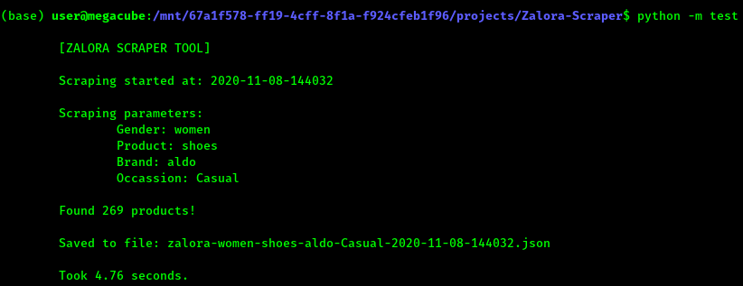
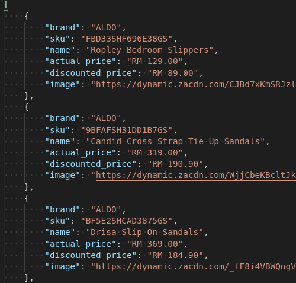

# Zalora Scraper
A scraper for Zalora written in Python

## Docker Usage:

First, build the Docker image:

```bash
docker build -t zalorascraper .
```

Then, run it (making sure to mount your current directory to /results):

```bash
docker run -v /results:$(pwd) zalorascraper:latest 
```

## Python Usage:

```python
from zalora_scraper import ZaloraScraper

scraper = ZaloraScraper()
scraper.scrape(
    gender="women",
    product="shoes",
    brand="aldo",
    occassion="Casual"  # note: occassion is case-sensitive
)
```

## Screenshots:

*Running on terminal:*



*JSON results:*

